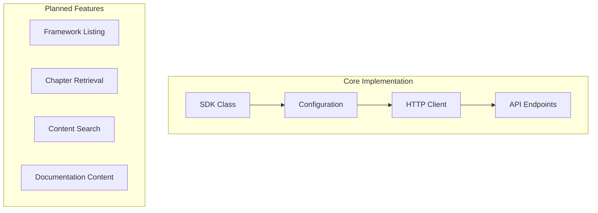

# Active Context

## Current Focus
Development of the Docs4AI SDK with emphasis on:
1. Setting up the dual JavaScript/TypeScript architecture
2. Implementing core API endpoints
3. Establishing type system
4. Creating build pipeline

## Recent Changes
None (Initial setup)

## Current Implementation Status

### Core SDK Structure


## Active Decisions

### 1. HTTP Client Implementation
Decision: Use native fetch API
Rationale:
- Zero dependencies
- Modern browser support
- Node.js 18+ compatibility
- Consistent API across environments

### 2. Type System Architecture
Decision: Separate type definitions for public API
Rationale:
- Clean separation of concerns
- Better developer experience
- Simplified maintenance
- Clear documentation

### 3. Package Distribution
Decision: Dual package approach
Rationale:
- Separate JS/TS packages
- Optimized for each use case
- Simplified dependency management
- Better tree-shaking support

## Next Steps

### Immediate Tasks
1. Initialize project structure
2. Set up build pipeline
3. Create core SDK class
4. Implement HTTP client
5. Add type definitions

### Short-term Goals
1. Framework listing endpoint implementation
2. Basic error handling
3. Initial test suite
4. Documentation structure

### Medium-term Goals
1. Complete endpoint implementations
2. Comprehensive testing
3. Integration examples
4. Performance optimizations

## Open Questions

1. API Rate Limiting
- How should we handle rate limits?
- Should we implement client-side throttling?
- What's the default timeout value?

2. Caching Strategy
- Should we implement client-side caching?
- What's the cache invalidation strategy?
- How to handle stale data?

3. Error Recovery
- How to handle network failures?
- Retry strategy for failed requests?
- Timeout handling approach?

## Active Considerations

### Performance
- Bundle size optimization
- Network request efficiency
- Type definition impact

### Security
- API key handling
- Request validation
- Error message security

### Maintainability
- Code organization
- Documentation standards
- Testing approach

## Development Priorities

### High Priority
1. Core SDK implementation
2. Type system setup
3. Basic endpoint integration
4. Error handling

### Medium Priority
1. Documentation generation
2. Integration examples
3. Performance optimization
4. Caching implementation

### Low Priority
1. Advanced features
2. Browser polyfills
3. Legacy support
4. Additional endpoints

## Integration Focus

### Next.js Integration
```typescript
// Priority implementation pattern
import { Docs4AI } from '@docs4ai/sdk';

export function createDocsClient() {
  return new Docs4AI({
    apiKey: process.env.DOCS4AI_API_KEY
  });
}
```

### React Integration
```typescript
// Planned React hook
function useDocumentation(query: string) {
  const [data, setData] = useState<DocResponse>();
  const docs = useDocs4AI();
  
  useEffect(() => {
    docs.query({ query }).then(setData);
  }, [query]);
  
  return data;
}
