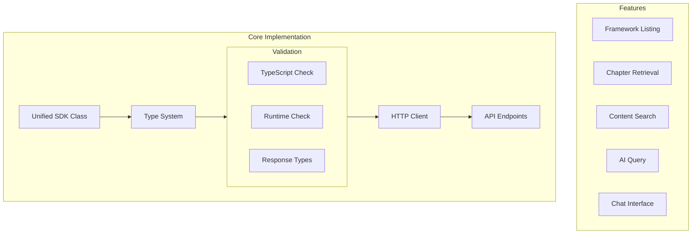

# Active Context

## Current Focus
Development of the Docs4AI SDK with emphasis on:
1. Unified JavaScript implementation with TypeScript types
2. Robust type system and validation
3. Testing infrastructure
4. Build pipeline optimization

## Recent Changes
1. Unified Implementation:
   - Combined TypeScript/JavaScript into single source
   - Added comprehensive JSDoc type annotations
   - Enhanced error handling and validation

2. Build System:
   - Updated package structure for better type support
   - Optimized Jest configuration for TypeScript
   - Improved build pipeline

3. Testing:
   - Added type validation tests
   - Improved test mocking
   - Enhanced error testing

## Current Implementation Status

### Core SDK Structure


## Active Decisions

### 1. Unified Implementation
Decision: Single JavaScript source with JSDoc types
Rationale:
- Better maintainability
- Full TypeScript support
- Simpler package structure
- Enhanced developer experience

### 2. Type System Architecture
Decision: JSDoc + .d.ts type definitions
Rationale:
- Type safety without compilation
- Strong editor support
- Runtime validation
- Simplified debugging

### 3. Testing Strategy
Decision: Dual testing approach
Rationale:
- Unit tests for functionality
- Type tests for type safety
- Comprehensive validation
- Better coverage

## Next Steps

### Immediate Tasks
1. Documentation updates
2. Integration examples
3. Browser testing
4. Performance optimization

### Short-term Goals
1. Browser compatibility testing
2. Example applications
3. Integration guides
4. API documentation

### Medium-term Goals
1. Caching system
2. Rate limiting
3. Offline support
4. Analytics integration

## Open Questions

1. Browser Compatibility
- Minimum browser versions to support?
- Polyfill strategy if needed?
- Bundle size optimization?

2. Caching Strategy
- Client-side caching approach?
- Cache invalidation rules?
- Storage mechanism?

## Integration Focus

### Next.js Integration
```typescript
// Current implementation pattern
import { Docs4AI } from '@docs4ai/sdk';

const sdk = new Docs4AI({
  apiKey: process.env.DOCS4AI_API_KEY,
  baseUrl: process.env.DOCS4AI_API_URL
});

// Type-safe API calls
const frameworks = await sdk.getFrameworks();
const chapters = await sdk.getChapters('react', '17.0.0');
```

### Error Handling Pattern
```typescript
try {
  const result = await sdk.search({
    framework: 'react',
    version: '17.0.0',
    query: 'hooks'
  });
} catch (error) {
  if (error instanceof Docs4AIError) {
    console.error(`${error.code}: ${error.message}`);
    // Error is properly typed
    if (error.status === 404) {
      // Handle not found
    }
  }
}
