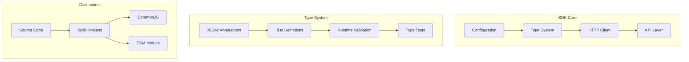
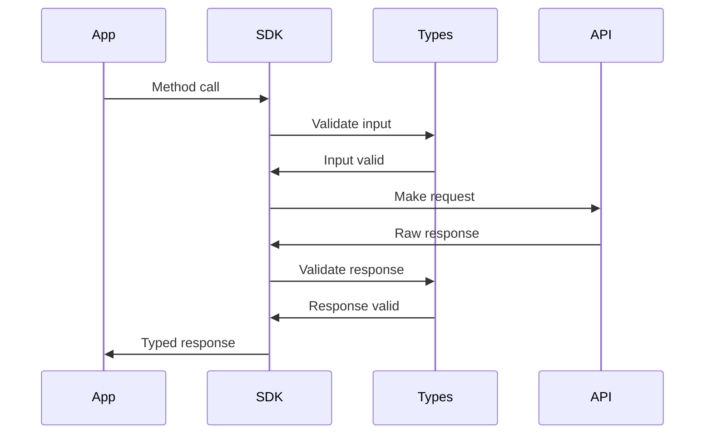

# System Patterns

## Architecture Overview



## Design Patterns

### 1. Type-Safe JavaScript Pattern
```javascript
/**
 * @param {string} framework Framework name
 * @param {string} version Framework version
 * @returns {Promise<ChapterInfo[]>} List of chapters
 */
async getChapters(framework, version) {
  if (!framework || !version) {
    throw new Docs4AIError('VALIDATION_ERROR', 'Framework and version are required');
  }
  return this.request(`/docs/${framework}/${version}/chapters`);
}
```

### 2. Error Handling Pattern
```typescript
class Docs4AIError extends Error {
  /**
   * @param {string} code Error code
   * @param {string} message Error message
   * @param {number} [status=500] HTTP status code
   * @param {any} [data=null] Additional error data 
   */
  constructor(code, message, status = 500, data = null) {
    super(message);
    this.name = 'Docs4AIError';
    this.code = code;
    this.status = status;
    this.data = data;
  }
}
```

### 3. API Client Pattern
```javascript
/**
 * @param {string} endpoint API endpoint
 * @param {RequestOptions} [options={}] Request options
 * @returns {Promise<any>} API response
 * @private
 */
async request(endpoint, options = {}) {
  try {
    const url = new URL(`${this.baseUrl}${endpoint}`);
    // Implementation
  } catch (error) {
    // Error handling
  }
}
```

## Request/Response Flow



## Type System

### Core Types
```typescript
interface Docs4AIConfig {
  apiKey: string;
  baseUrl?: string;
}

interface SearchParams {
  framework: string;
  version: string;
  query: string;
}

interface QueryRequest {
  framework: string;
  version: string;
  question: string;
}

interface ChatRequest {
  model: string;
  messages: ChatMessage[];
  max_tokens?: number;
  temperature?: number;
}
```

### Response Types
```typescript
interface FrameworkInfo {
  name: string;
  versions: string[];
}

interface ChapterInfo {
  title: string;
  chapterId: string;
}

interface SearchResult {
  title: string;
  snippet: string;
  chapterId: string;
}

interface QueryResponse {
  content: string;
  sources: any[];
}
```

## File Structure Pattern

```
src/
├── index.js        # Main implementation with JSDoc types
├── index.d.ts      # TypeScript definitions
└── __tests__/
    ├── index.test.js         # Functional tests
    └── type-validation.test.ts # Type system tests
```

## Testing Patterns

### Response Mocking
```typescript
const createMockResponse = <T>(data: T): Response => {
  const blob = new Blob([JSON.stringify(data)], { 
    type: 'application/json' 
  });
  return new Response(blob, {
    status: 200,
    statusText: 'OK',
    headers: {
      'Content-Type': 'application/json'
    }
  });
};
```

### Type Validation
```typescript
import { expectType } from 'tsd';

// Type checking tests
const frameworks = await sdk.getFrameworks();
expectType<FrameworkInfo[]>(frameworks);

const chapters = await sdk.getChapters('react', '17.0.0');
expectType<ChapterInfo[]>(chapters);
```

## Error Recovery Pattern
```javascript
try {
  const response = await sdk.query({
    framework: 'react',
    version: '17.0.0',
    question: 'How do hooks work?'
  });
} catch (error) {
  if (error instanceof Docs4AIError) {
    switch (error.code) {
      case 'VALIDATION_ERROR':
        // Handle validation errors
        break;
      case 'API_ERROR':
        // Handle API errors
        break;
      case 'NETWORK_ERROR':
        // Handle network errors
        break;
    }
  }
}
