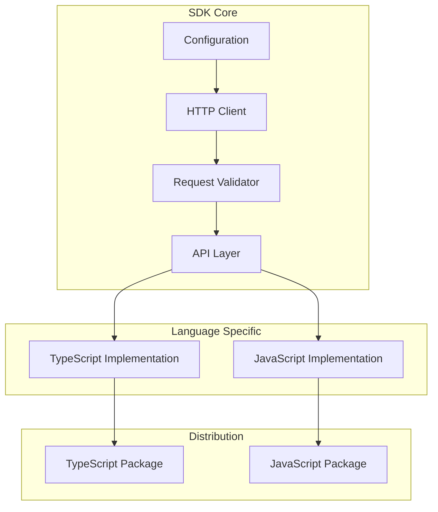
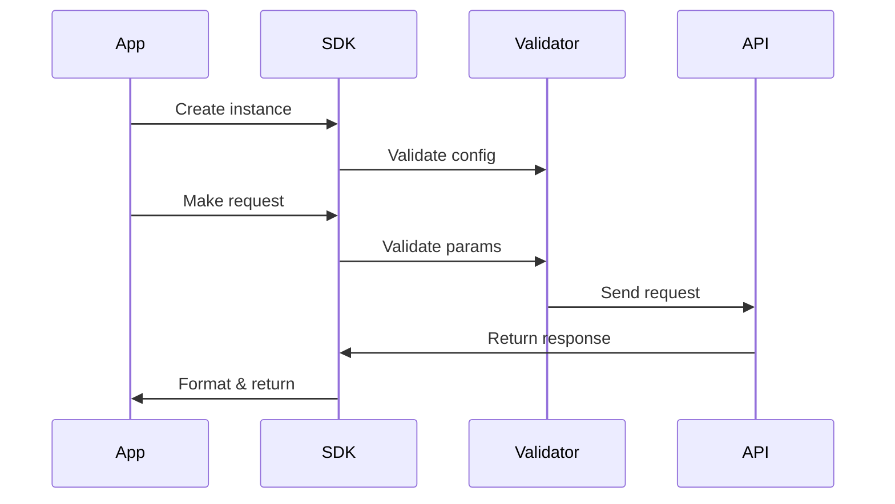

# System Patterns

## Architecture Overview



## Design Patterns

### 1. Singleton Pattern
```typescript
// Ensure single instance per configuration
export class Docs4AI {
  private static instances = new Map<string, Docs4AI>();
  
  private constructor(config: Docs4AIConfig) {
    // Initialize instance
  }
  
  public static getInstance(config: Docs4AIConfig): Docs4AI {
    const key = JSON.stringify(config);
    if (!Docs4AI.instances.has(key)) {
      Docs4AI.instances.set(key, new Docs4AI(config));
    }
    return Docs4AI.instances.get(key)!;
  }
}
```

### 2. Factory Pattern
Used for creating appropriate response objects based on API endpoints:
```typescript
class ResponseFactory {
  static create(endpoint: string, data: any): BaseResponse {
    switch (endpoint) {
      case 'frameworks':
        return new FrameworksResponse(data);
      case 'chapters':
        return new ChaptersResponse(data);
      case 'search':
        return new SearchResponse(data);
      default:
        return new BaseResponse(data);
    }
  }
}
```

### 3. Strategy Pattern
For different request handling strategies:
```typescript
interface RequestStrategy {
  execute(params: any): Promise<any>;
}

class FrameworkListStrategy implements RequestStrategy {
  execute(params: any): Promise<any> {
    // Implementation
  }
}

class ChapterSearchStrategy implements RequestStrategy {
  execute(params: any): Promise<any> {
    // Implementation
  }
}
```

## Error Handling Pattern

```typescript
class Docs4AIError extends Error {
  constructor(
    public code: string,
    message: string,
    public status?: number,
    public data?: any
  ) {
    super(message);
    this.name = 'Docs4AIError';
  }
}

// Usage
try {
  await docs4ai.query(params);
} catch (error) {
  if (error instanceof Docs4AIError) {
    // Handle SDK-specific error
  } else {
    // Handle unexpected error
  }
}
```

## Request/Response Flow



## Type System

### Core Types
```typescript
interface Docs4AIConfig {
  apiKey: string;
  baseUrl?: string;
  timeout?: number;
}

interface QueryParams {
  framework: string;
  version: string;
  query: string;
}

interface QueryResponse {
  content: string;
  sources: string[];
  metadata: {
    framework: string;
    version: string;
    timestamp: string;
  };
}
```

### Response Types
```typescript
interface FrameworkInfo {
  name: string;
  versions: string[];
}

interface ChapterInfo {
  title: string;
  chapterId: string;
  path: string;
}

interface SearchResult {
  title: string;
  snippet: string;
  chapterId: string;
  relevance: number;
}
```

## File Structure Pattern

```
src/
├── core/
│   ├── client.ts
│   ├── config.ts
│   ├── errors.ts
│   └── validator.ts
├── typescript/
│   ├── index.ts
│   └── types/
├── javascript/
│   └── index.js
└── shared/
    ├── constants.ts
    └── utils.ts
