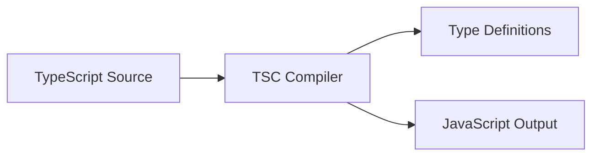
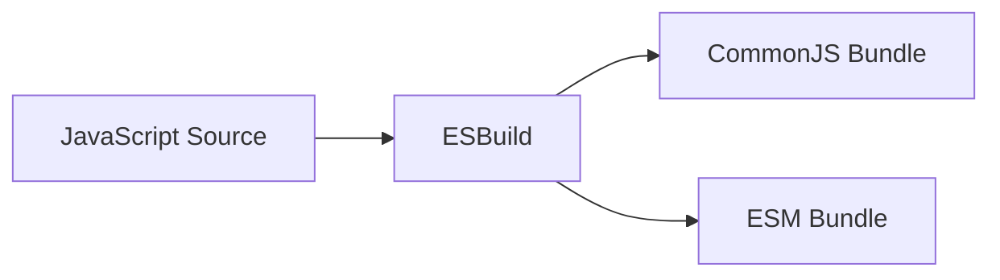

# Technical Context

## Technology Stack

### Core Technologies
- TypeScript 5.x
- JavaScript (ES2021+)
- Node.js 18+ (development)
- Next.js 14.2.24 (integration target)

### Development Tools
- npm (package management)
- Jest (testing)
- ESLint (linting)
- Prettier (code formatting)
- TypeDoc (documentation generation)

### Build Tools
- tsc (TypeScript compilation)
- esbuild (bundling)
- rollup (package optimization)

## Development Setup

### Environment Setup
```bash
# Required tools
node -v  # >= 18.0.0
npm -v   # >= 8.0.0

# Project initialization
npm init -y
npm install typescript @types/node --save-dev
npx tsc --init
```

### Project Configuration

#### TypeScript Config (tsconfig.json)
```json
{
  "compilerOptions": {
    "target": "es2021",
    "module": "esnext",
    "lib": ["es2021", "dom"],
    "declaration": true,
    "outDir": "./dist",
    "strict": true,
    "esModuleInterop": true,
    "skipLibCheck": true,
    "forceConsistentCasingInFileNames": true
  },
  "include": ["src"],
  "exclude": ["node_modules", "**/*.test.ts"]
}
```

#### Package Configuration (package.json)
```json
{
  "name": "@docs4ai/sdk",
  "version": "1.0.0",
  "description": "Documentation SDK for framework documentation access",
  "main": "dist/javascript/index.js",
  "module": "dist/javascript/index.mjs",
  "types": "dist/typescript/index.d.ts",
  "exports": {
    ".": {
      "require": "./dist/javascript/index.js",
      "import": "./dist/javascript/index.mjs",
      "types": "./dist/typescript/index.d.ts"
    }
  },
  "scripts": {
    "build": "npm run build:ts && npm run build:js",
    "build:ts": "tsc",
    "build:js": "node build.js",
    "test": "jest",
    "lint": "eslint src",
    "format": "prettier --write \"src/**/*.{ts,js}\""
  }
}
```

## Dependencies Management

### Development Dependencies
```json
{
  "devDependencies": {
    "typescript": "^5.0.0",
    "@types/node": "^18.0.0",
    "jest": "^29.0.0",
    "@types/jest": "^29.0.0",
    "ts-jest": "^29.0.0",
    "eslint": "^8.0.0",
    "@typescript-eslint/parser": "^5.0.0",
    "@typescript-eslint/eslint-plugin": "^5.0.0",
    "prettier": "^2.0.0",
    "esbuild": "^0.17.0",
    "rollup": "^3.0.0"
  }
}
```

### Production Dependencies
- Zero runtime dependencies
- All HTTP functionality uses native fetch
- JSON parsing/stringifying uses native methods

## Build Process

### 1. TypeScript Build


### 2. JavaScript Build


## Testing Strategy

### Unit Tests
- Jest for test running
- Individual component testing
- Mocked HTTP responses
- Type checking tests

### Integration Tests
- End-to-end API tests
- Next.js integration tests
- Browser compatibility tests
- Node.js compatibility tests

## Documentation

### API Documentation
- TypeDoc for API documentation
- Markdown for guides
- JSDoc comments
- Usage examples

### Distribution
- npm package
- CDN availability
- Source maps
- Type definitions

## Compatibility

### Browser Support
- Modern browsers (last 2 versions)
- IE11 not supported
- Uses native fetch API

### Node.js Support
- Node.js 18+ (for fetch API)
- Both CJS and ESM support
- Native TypeScript support
