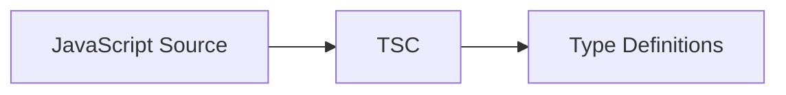
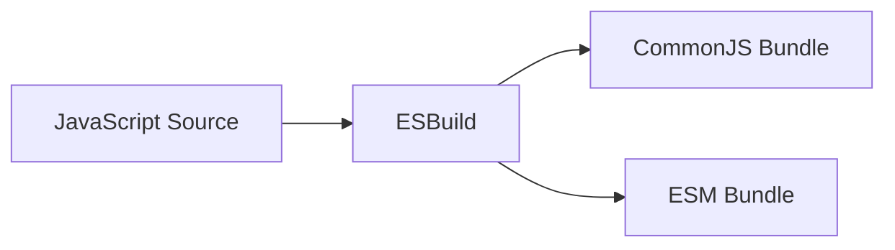

# Technical Context

## Technology Stack

### Core Technologies
- TypeScript 5.x
- JavaScript (ES2021+)
- Node.js 18+ (for development and fetch API)
- Jest 29.x (testing)

### Development Tools
- npm (package management)
- Jest (testing with ts-jest)
- ESLint (linting)
- Prettier (code formatting)
- tsd (type testing)

### Build Tools
- tsc (type generation)
- esbuild (bundling)
- ts-jest (test transpilation)

## Development Setup

### Environment Setup
```bash
# Required tools
node -v  # >= 18.0.0
npm -v   # >= 8.0.0

# Project initialization
npm install
npm run build
```

### Project Configuration

#### TypeScript Config (tsconfig.json)
```json
{
  "compilerOptions": {
    "target": "es2021",
    "module": "esnext",
    "lib": ["es2021", "dom"],
    "declaration": true,
    "emitDeclarationOnly": true,
    "outDir": "./dist",
    "rootDir": "./src",
    "strict": true,
    "esModuleInterop": true,
    "skipLibCheck": true,
    "forceConsistentCasingInFileNames": true,
    "moduleResolution": "node",
    "resolveJsonModule": true,
    "isolatedModules": true,
    "allowJs": true,
    "checkJs": true
  },
  "include": ["src/**/*"],
  "exclude": ["node_modules", "**/*.test.ts", "**/*.test.js", "dist"]
}
```

#### Package Configuration (package.json)
```json
{
  "name": "@docs4ai/sdk",
  "version": "1.0.0",
  "main": "dist/index.js",
  "module": "dist/index.mjs",
  "types": "dist/index.d.ts",
  "exports": {
    ".": {
      "require": "./dist/index.js",
      "import": "./dist/index.mjs",
      "types": "./dist/index.d.ts"
    }
  },
  "scripts": {
    "build": "npm run build:types && npm run build:js",
    "build:types": "tsc --emitDeclarationOnly",
    "build:js": "esbuild src/index.js --bundle --platform=neutral --outfile=dist/index.js --format=cjs && esbuild src/index.js --bundle --platform=neutral --outfile=dist/index.mjs --format=esm",
    "test": "npm run test:unit && npm run test:types"
  }
}
```

### Jest Configuration
```json
{
  "jest": {
    "preset": "ts-jest",
    "testEnvironment": "node",
    "moduleFileExtensions": ["ts", "js"],
    "transform": {
      "^.+\\.ts$": ["ts-jest", {
        "tsconfig": "tsconfig.json",
        "allowJs": true
      }],
      "^.+\\.js$": "babel-jest"
    }
  }
}
```

## Dependencies Management

### Development Dependencies
```json
{
  "devDependencies": {
    "@babel/core": "^7.24.0",
    "@babel/preset-env": "^7.24.0",
    "@types/jest": "^29.0.0",
    "@types/node": "^18.0.0",
    "@typescript-eslint/eslint-plugin": "^5.0.0",
    "@typescript-eslint/parser": "^5.0.0",
    "babel-jest": "^29.0.0",
    "esbuild": "^0.17.0",
    "eslint": "^8.0.0",
    "jest": "^29.0.0",
    "prettier": "^2.0.0",
    "ts-jest": "^29.0.0",
    "tsd": "^0.31.2",
    "typescript": "^5.0.0"
  }
}
```

### Production Dependencies
- Zero dependencies
- Native fetch API
- Native ES modules/CommonJS support

## Build Process

### 1. Type Generation


### 2. Bundle Generation


## Testing Strategy

### Unit Tests (index.test.js)
- Function testing
- Error cases
- API integration
- Mock responses

### Type Tests (type-validation.test.ts)
- Type definitions
- Runtime validation
- Response types
- Error types

## Documentation

### API Documentation
- JSDoc comments
- Type definitions
- Usage examples
- Integration guides

### Distribution
- npm package
- Source maps (planned)
- CDN availability (planned)
- Type definitions

## Compatibility

### Browser Support
- Modern browsers
- Native fetch API required
- ESM module support
- No IE11 support

### Node.js Support
- Node.js 18+
- Native fetch API
- ESM modules
- CommonJS compatibility

## Performance Considerations

### Bundle Size
- Minimal dependencies
- Tree-shaking support
- Separate type definitions
- Optimized builds

### Network
- Native fetch
- JSON parsing
- Streaming support
- Error handling

### Types
- Zero runtime overhead
- Development-time validation
- Editor support
- Smaller production builds
